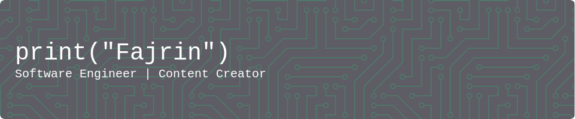

# 👋 Hai, aku Fajrin!

Selamat datang di sudut kecil kehidupanku – tempat di mana kode, kopi, dan kreativitas bertemu. ☕💻

## 🛠️ Aku Pengguna

## 📦 Biasanya aku simpan-simpan di

## 🪚 Senjata lain yang biasa aku pakai

## 🚀 Ngapain aja kalo lagi santai?

aku bikin konten-konten di:

Jangan lupa like & follow ya, biar makin semangat upload konten baru! 🚀

## 🗣️ Kalo mau ngobrol bisa colek-colek di

---

> "Keep it simple, make it fun, and always indent with love." 😄

Thanks udah mampir. Jangan lupa kasih ⭐ kalau nemu sesuatu yang keren ya!

